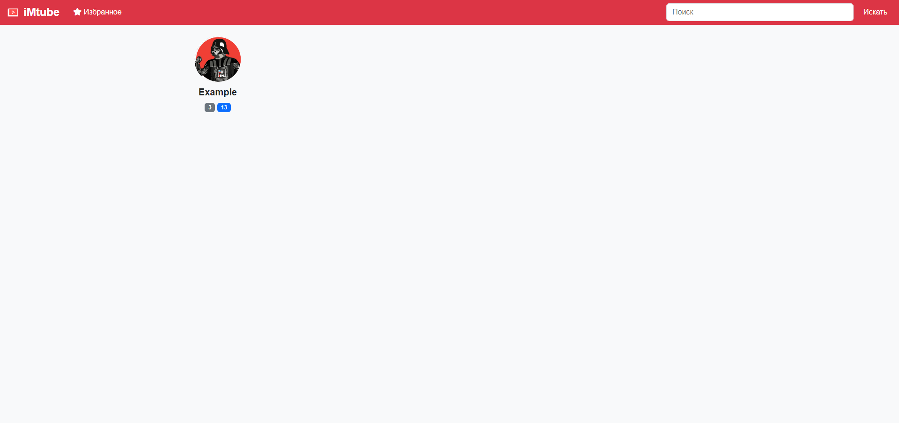
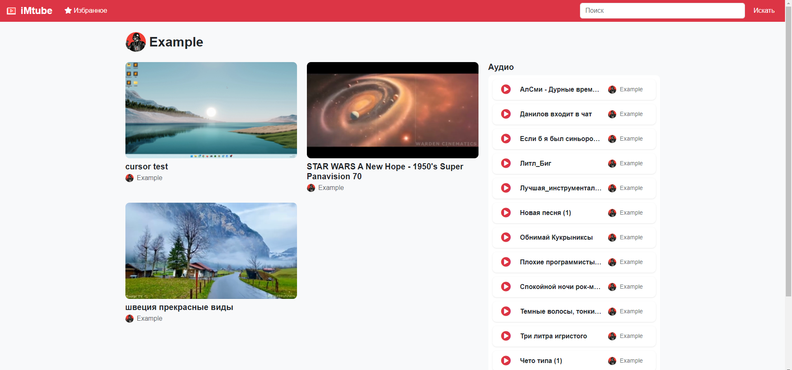
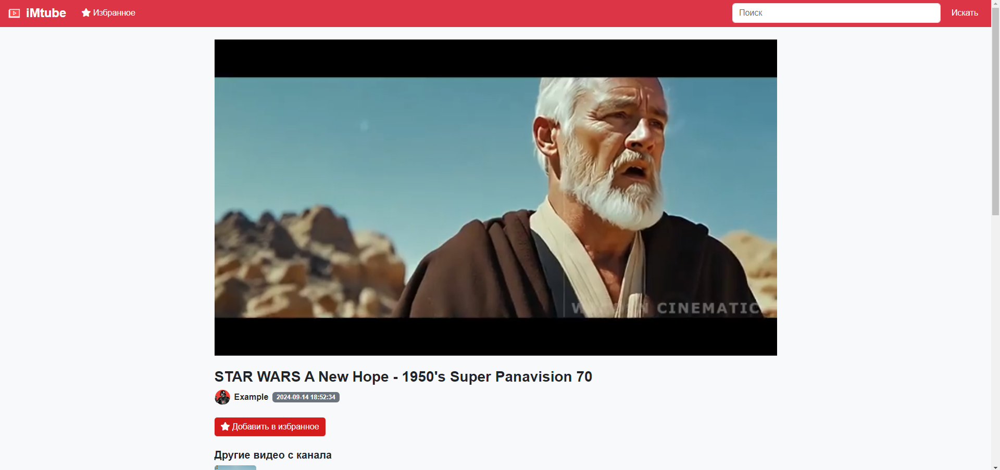
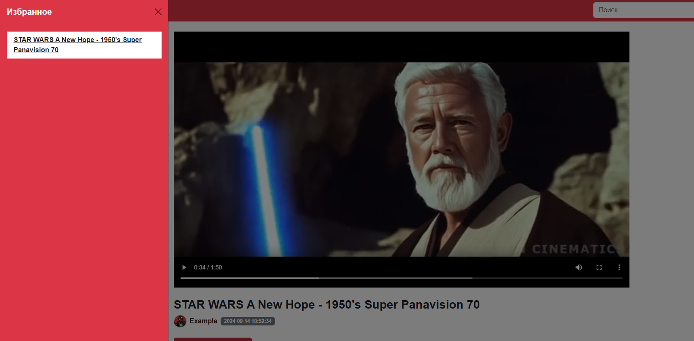
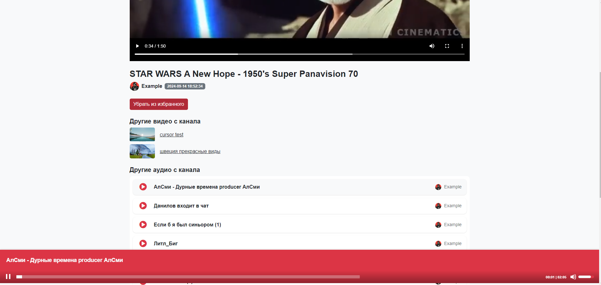

# iMtube

## Описание проекта

iMtube — это персональный видео-аудио хостинг, созданный для воспроизведения локальных видео и аудиофайлов через веб-интерфейс. Проект задуман как эксперимент, чтобы проверить возможности современных нейросетей в программировании. В результате получился мощный мультимедийный портал, где каждая папка с видео и аудио представлена как отдельный "канал", со своей иконкой, поддержкой просмотра видео, прослушивания аудио и удобным поиском.

#### Проект позволяет:

- Просматривать локальные видео и аудио файлы через браузер.
- Каждая папка с видео — это как отдельный канал со своей иконкой.
- Генерируются превью для видео с помощью FFmpeg.
- Система поиска по видео и аудио.
- Возможность добавлять видео в избранное (сохраняется в localStorage).
- Встроенный аудиоплеер для прослушивания музыки.
- Удобная структура, напоминающая YouTube, но с локальными файлами.

## Зачем это нужно?

iMtube — это инструмент для организации и просмотра мультимедийных файлов прямо с вашего компьютера через удобный интерфейс. Он может пригодиться для:

- Личного мультимедийного архива: если у вас много видео или музыки на локальном диске, **iMtube** позволит вам систематизировать их и просматривать прямо через браузер. 
- Домашний медиа-сервер: вы можете запускать **iMtube** как сервер и делиться своими видео и аудиофайлами с домашними устройствами.
- Исследовательский проект: **iMtube** — это результат эксперимента, и он демонстрирует, насколько эффективно современные нейросети могут автоматизировать написание кода.

## История создания

Этот проект — результат уникального эксперимента. История его создания проста и в то же время впечатляюща:

Вчера я получил доступ к новой версии модели ChatGPT (o1-preview) и решил провести эксперимент: смогу ли я создать рабочее приложение, почти полностью написанное нейросетью? И это сработало! 96% кода было написано **ChatGPT o1-preview**, 3% дописано с помощью **ChatGPT-4**, и лишь 1% — это мои личные доработки.

Проект стал своего рода проверкой того, насколько далеко может зайти нейронка в программировании реальных приложений. За основу я взял идею сделать личный аналог YouTube, который будет работать с локальными видео и аудио. Проект получился буквально за пару часов. Сегодня вечером я добавил аудиоплеер, чтобы система могла воспроизводить и музыку.

_**iMtube** — это эксперимент, который показывает силу современных технологий в реальном времени. Это не просто приложение, а пример того, как можно использовать нейросети для разработки реальных решений._

## Установка и запуск

Для того, чтобы запустить этот проект на вашем компьютере, выполните следующие шаги:

### Установите зависимости

Убедитесь, что у вас установлен Python версии 3.10 или выше. Далее установите необходимые зависимости с помощью файла requirements.txt:

```bash
pip install -r requirements.txt
```

### Установите FFmpeg

Проект использует [FFmpeg](https://www.ffmpeg.org/) для генерации превью для видео. Убедитесь, что он установлен на вашем компьютере и он добавлен в переменные окружения.


### Запуск приложения

После установки всех зависимостей, запустите проект командой:

```bash
python app.py
```

После этого приложение будет доступно по адресу: http://127.0.0.1:8000

## Где хранятся файлы?

- `videos/` - Эта папка содержит видеофайлы. Каждая папка внутри — это отдельный "канал" со своими видео и аудиофайлами.


Каждая папка в директории videos — это отдельный канал. Внутри папки можно разместить:

- Логотип канала: файл logo.png.
- Видео и аудиофайлы: видео (.mp4, .avi, .mkv) и аудио (.mp3, .wav, .ogg).

## Как пользоваться?

- Главная страница: после запуска откройте браузер и перейдите на http://127.0.0.1:8000. Вы увидите список "каналов" — это папки с вашими видеофайлами.
- Просмотр видео: выберите канал и кликните на любое видео. Будет доступен плеер для воспроизведения, а также список других видео с этого канала.
- Прослушивание аудио: в каждом канале есть аудиофайлы, которые можно воспроизводить через встроенный аудиоплеер.
- Избранное: у видео есть кнопка "Добавить в избранное". Это добавит видео в раздел избранного, который можно открыть через иконку в навигации.
- Поиск: с помощью поисковой строки можно искать каналы, видео и аудиофайлы по имени.

## Скриншоты

#### Главная страница

#### Страница канала

#### Просмотр видео

#### Избранное

#### Аудиоплеер


## Планы на будущее

- **Настройки**: Добавлю блок с настройками, где можно будет указать расположение папки с "каналами". Это упростит изменение структуры без необходимости в ручных правках.
- **Docker и хостинг**: Планирую создать образ Docker, чтобы приложение можно было легко запускать на любом сервере и даже хостить в интернете, предоставляя доступ к локальным медиафайлам.
- **Интеграция с YouTube**: Внедрение функции для загрузки видео или аудио с YouTube и автоматической загрузки их в выбранные каналы.
- **Веб-интерфейс для управления файлами**: Появится возможность добавлять видео и аудиофайлы в каналы прямо через веб-интерфейс, без использования файловых менеджеров.

## Заключение
Если у вас есть вопросы или предложения по улучшению проекта, всегда можем обсудить их! Залетайте на мой канал: [Тяжелая жизнь разработчика..](https://t.me/dev_survival).

### Приятного использования!

